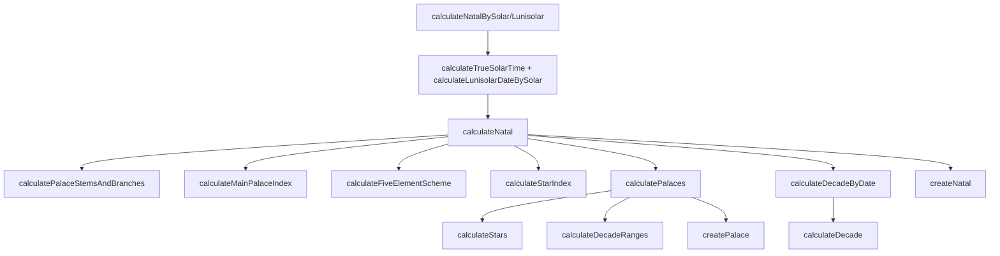

# @ziweijs/core 架构说明

`@ziweijs/core` 是紫微斗数引擎的最小实现，提供算法、数据模型与对外 API，所有上层包（React 组件、Hooks、聚合 SDK）都直接依赖此包的稳定行为。

## 目录速览

```text
packages/core/
├─ src/
│  ├─ constants/       # 天干地支、星曜、五行局等静态枚举
│  ├─ infra/
│  │  ├─ configs/      # GlobalConfigs 默认值与合法选项
│  │  └─ i18n/         # createZiWeiI18n、内置 zh-Hans/zh-Hant 资源
│  ├─ context/         # createZiWeiRuntime、defaultRuntime
│  ├─ rules/           # 起宫、布星、五行局、化曜等纯算法
│  ├─ services/        # calculateNatal/Palaces/Stars/Decade 等领域组合
│  ├─ pipelines/       # calculateNatalBySolar/Lunisolar 调度入口
│  ├─ models/          # createNatal/Palace/Star 等领域对象工厂
│  ├─ typings/         # 公共类型定义、VO 接口
│  ├─ utils/
│  │  ├─ calendar.ts   # 日历换算（阳历/阴历）、闰月/子时策略、干支推导
│  │  ├─ trueSolarTime.ts # 真太阳时（NOAA 公式）
│  │  ├─ format.ts     # 日期/时辰文本格式化
│  │  ├─ math.ts       # wrapIndex 等数学辅助
│  │  ├─ memoize.ts    # 轻量缓存辅助
│  │  └─ sexagenary.ts # 干支算法
│  ├─ sdk.ts           # 默认 runtime 封装的 createZiWeiBy*
│  ├─ public.ts        # 单一出口，聚合 re-export
│  └─ index.ts         # re-export public.ts，供 bundler tree-shaking
└─ docs/               # 设计/架构文档（当前文件）
```

## 分层职责

- **Constants**：集中维护枚举值、映射表与 meta 信息（星耀分组、十二宫 key、四化配置等），供算法层查表使用。
- **Infra**：
  - `infra/configs` 暴露 `GlobalConfigs`，通过 `division.year/month/day` 描述年、月、日的分界策略，`star` 控制布星模式；`getGlobalConfigs()` 始终返回副本。
  - `infra/i18n` 使用 `@ziweijs/i18n` 初始化翻译实例，`createZiWeiI18n` 支持自定义默认语言，`i18n` 供工具函数（如 `getLunisolarDateText`）在无 runtime 时复用。
- **Context**：`createZiWeiRuntime({ i18n, configs, now })` 创建运行时容器；所有 services/pipelines 通过 runtime 访问依赖（翻译、全局配置、时间），`defaultRuntime` 被 SDK 默认使用。
- **Rules**：保持纯函数属性，不依赖 runtime，包含公式型逻辑（例如 `calculateFiveElementScheme`、`calculateMainPalaceIndex`、`memoCalculateStarTransformation`）。
- **Services**：在 runtime 上实现领域动作。例如 `calculateNatal` 负责组合命盘、十二宫与大限，内部再调用 `calculatePalaces`（构建宫位、布星）与 `calculateDecadeByDate`（根据参考时间推导大限）。
- **Pipelines**：面向业务输入（公历或农历字符串），封装时间换算与参数校准。`calculateNatalBySolar` 会按需执行真太阳时修正、转换为 `tyme4ts` 的 `LunarHour` 后再进入 `calculateNatal`。
- **Models**：封装领域实体的附加能力，如 `createNatal` 内部挂载 `getDecade()`、`getDecadeIndex()`，`createPalace` 提供 `flying()` 计算宫位化曜。
- **Typings**：集中导出 `CreateZiWeiSolarParams`、`NatalCalculateParams`、`Palace`、`Star` 等类型，确保跨层 API 一致性。
- **Utils**：`utils/calendar.ts`/`utils/trueSolarTime.ts`/`utils/format.ts` 处理与时间相关的逻辑与文本，`utils/memoize` 封装通用缓存工具，`utils/math`、`utils/sexagenary` 提供非业务数学/干支操作。
  - 自 vX.Y.Z 起已拆分为 `calendar.ts` / `trueSolarTime.ts` / `format.ts`，`date.ts` 仅保留聚合导出用于兼容，建议新代码直接从拆分模块引入。
- **SDK & Public API**：`sdk.ts` 暴露 `createZiWeiBySolar` / `createZiWeiByLunisolar` 并 re-export runtime 类型；`public.ts` 是包的最终出口，集中导出常量、工具、类型及 SDK。

## 运行链路

### Solar 流程（默认入口）

1. **SDK 调用**：使用方调用 `createZiWeiBySolar(params, options)`，SDK 会基于 `defaultRuntime` 执行 `calculateNatalBySolar`。
2. **多语言设置**：pipeline 根据 `params.language` 调用 `runtime.i18n.setCurrentLanguage`，保证整个请求生命周期的翻译一致。
3. **真太阳时修正**：当传入 `longitude` 且 `useTrueSolarTime` 为 `true` 时，`calculateTrueSolarTime` 会在 `utils/trueSolarTime.ts` 内依据 NOAA 公式对时间做校正，结果写入 `solarDateByTrue`。
4. **阳历→阴历**：`calculateLunisolarDateBySolar` 使用 `tyme4ts` 将 JS `Date` 转换为 `LunarHour`，再由 `calculateNatalDateBySolar` 结合 `GlobalConfigs` 处理晚子时、闰月策略，得到干支、月索引、日与时辰。
5. **计算命盘**：pipeline 将转换后的结构组装为 `NatalCalculateParams`，交给 `services/natal.calculateNatal`。
6. **构建宫位与星曜**：`calculateNatal` 调用 `rules/palace` 与 `rules/star` 获得十二宫顺序、五行局、主/辅星分布，交由 `services/palace.calculatePalaces` 使用 `createPalace` 构建可读对象。
7. **推导大限/流年**：`services/decade.calculateDecadeByDate` 结合 runtime 的 `now()`（或 `options.referenceDate`）来确定当前大限索引，再生成 12 宫大限列表与每宫 10 年的流年起点。
8. **产出模型**：`createNatal` 最终返回包含 UI 所需字段、十二宫、运限、helper 方法的 `Natal` 实例。

### Lunisolar 流程

- `createZiWeiByLunisolar` 直接接收 `"YYYY-MM-DD-HH"` 格式的农历字符串，通过 `calculateZiWeiDate` 获得干支、月、日、时索引，同时利用 `tyme4ts` 求出对应的阳历时间，后续步骤与 Solar 流程一致。

## 排盘算法逻辑与设计

`packages/core/src/services/natal.ts` 是排盘流水线的核心。它与 `rules/*`、`services/*` 其余模块协作，完成从输入时间到 `Natal` 模型的全流程计算。

### 坐标与索引体系

| 维度                                      | 取值范围                  | 说明                                                   |
| ----------------------------------------- | ------------------------- | ------------------------------------------------------ |
| 宫位/地支 (`BRANCH_KEYS` / `PALACE_KEYS`) | 12 个元素，默认从寅宫开始 | 所有宫位算法都在数组上做环形运算，`wrapIndex` 负责取模 |
| 月份 (`monthIndex`)                       | `0-11`（农历正月至腊月）  | Pipeline 在 `calculateNatalDateBySolar` 中输出         |
| 时辰 (`hourIndex`)                        | `0-11`（子时至亥时）      | 与月份共同决定命宫索引                                 |
| 天干 (`STEM_KEYS`)                        | 10 个元素（甲乙丙丁…癸）  | 推导十二宫干支序列、五行局、化曜                       |
| 五行局 (`FIVE_ELEMENT_SCHEME_VALUES`)     | `2/3/4/5/6`               | 由命宫干支确定；影响布星与大限方向                     |

### 流水线概览

```text
┌──────────────┐     ┌──────────────────┐     ┌────────────────────┐     ┌───────────────────┐
│ Step 1       │     │ Step 2           │     │ Step 3             │     │ Step 4            │
│ 输入归一化     ├──▶──┤ 命宫 / 五行局      ├──▶──┤  布星 + 十二宫构建   ├──▶──┤ 大限 / 模型输出     │
└──────────────┘     └──────────────────┘     └────────────────────┘     └───────────────────┘
```

#### Step 1. 输入归一化（pipelines + utils）

- `calculateNatalBySolar`/`calculateNatalByLunisolar` 负责语言切换、真太阳时修正 (`calculateTrueSolarTime`)、阳历转农历 (`calculateLunisolarDateBySolar`)。
- `calculateNatalDateBySolar` 结合 `GlobalConfigs` 处理闰月/晚子时，并输出 `monthIndex`、`day`、`hourIndex` 及出生年干支。
- pipeline 将最终结果整合为 `NatalCalculateParams`，传入 `calculateNatal(runtime, params, options)`。

#### Step 2. 命宫骨架与五行局（rules/palace + rules/element）

1. `calculatePalaceStemsAndBranches(birthYearStemKey)`: 依据出生年干构造“十二宫 × 天干/地支”表。
2. `calculateMainPalaceIndex(monthIndex, hourIndex)`: 以寅宫为原点，按“顺月逆时”推算命宫落点。
3. `calculateFiveElementScheme(mainPalaceStemKey, mainPalaceBranchKey)`: 产出五行局名称与数值。
4. `calculateStarIndex(day, fiveElementSchemeValue)`: 确定紫微、天府基准宫索引。

输出：`palaceStemsAndBranches`、`mainPalaceIndex`、`fiveElementSchemeValue`、`ziweiIndex/tianfuIndex` 等，为布星阶段提供输入。

#### Step 3. 布星与十二宫构建（services/palace + rules/star + models/palace）

- `services/star.calculateStars`：
  - `createMajorStarsMeta` / `createMinorStarsMeta` 搭建主星、左右昌曲等星曜的相对位置信息；
  - `memoCalculateStarTransformation` 根据出生年干与宫干查表四化，生成禄/权/科/忌与自化 (ST)。
- `rules/decade.calculateDecadeRanges`：按照命宫、顺逆行与五行局数为每宫分配十年区间。
- `calculatePalaces` 组合上述信息，逐宫调用 `createPalace` 填入干支、星曜、来因宫判定 (`isLaiYin`)、大限区间。

输出：`palaces: Palace[]`，UI 可以直接渲染每宫的星曜与区间。

#### Step 4. 大限/流年与模型封装（services/decade + models/natal）

- `calculateDecadeByDate`：
  - 使用 `runtime.now()` 或 `referenceDate` 重新获取时间，换算成农历年与虚岁；
  - 根据虚岁寻找当前大限宫位，若超出区间则回退到命宫；
  - 调用 `calculateDecade` 与 `calculateYearly` 生成 12 宫大限与十年流年。
- `createNatal` 聚合基础信息 + `palaces` + `decade`，并挂载 `getDecade(index)`、`getDecadeIndex()` 等 helper。

最终得到 `Natal` 模型（包含真太阳时文本、干支日期、紫微所在地支、生肖等）。

### 函数关系图



### 设计考量

- **纯算法隔离**：`rules/*` 保持无状态、可单测，`services/*` 才接触 runtime 依赖。
- **可配置性**：闰月、晚子时、年分界与布星策略等差异均通过 `GlobalConfigs` 承载；所有下游函数仅访问 `ctx.configs`。
- **I18n 贯穿**：`calculatePalaces`、`calculateStars`、`createDecadePalace` 等通过 `ctx.i18n` 获取名称，输出即为最终展示文本。
- **性能友好**：布星流程借助 remeda `pipe` 串联，在 `memoCalculateStarTransformation` 中缓存四化查表结果，避免重复遍历。
- **确定性**：除时间换算外的函数全部 deterministic，利于快照测试、回归验证。

## Runtime 与依赖注入

- `createZiWeiRuntime` 支持覆盖三类依赖：
  - `i18n`：可注入共享或受控的 `createZiWeiI18n()` 实例，用于自定义语言资源或与宿主应用共享状态。
  - `configs`：覆盖 `GlobalConfigs` 以满足不同派别的年/月/日分界与布星策略。例如 `division.month = "last"` 会把闰月统一归入上个月，`star = "onlyMajor"` 可仅计算主星。
  - `now`：注入时间提供者，便于 SSR 或测试环境（如冻结时间）。
- `CreateZiWei*Params` 支持 `referenceDate`，覆盖单次命盘计算的大限参考日期。

### GlobalConfigs 速览

| 字段             | 默认值     | 说明                                                                                          |
| ---------------- | ---------- | --------------------------------------------------------------------------------------------- |
| `division.year`  | `"normal"` | `normal` 正月初一分界；`spring` 切换为立春分界。                                              |
| `division.month` | `"normal"` | 闰月归属策略：`last` 归上月，`next` 归下月，`normal` 依据十五日前后自动判断。                 |
| `division.day`   | `"normal"` | 晚子时处理：`normal` 视为次日，`current` 保持当日。                                           |
| `star`           | `"normal"` | 布星模式：`normal` 主/辅星全量，`onlyMajor` 仅主星，`onlyTransformation` 仅保留四化相关位置。 |

## 数据模型

- **Natal**：通过 `createNatal(ctx, props)` 生成，包含命盘概览、十二宫、运限，并附带 `getDecade(index)`、`getDecadeIndex()` 等便捷方法。
- **Palace**：`createPalace` 按宫位 key 生成结构化数据，保存宫位干支、主星列表、十年区间以及 `flying()`（干支化曜）方法。
- **Star**：`createStar` 统一封装主/辅星属性，包含星系、四化（YT/ST）等信息，便于上层渲染。
- 所有模型及 VO 类型均在 `src/typings` 中定义，`public.ts` 会 re-export，方便外部直接引用 TS 类型。

## 扩展指引

- **新增算法**：始终优先放在 `rules/*`，保证纯函数和可测试性，再由 `services/*` 对外组合。
- **扩展 pipeline**：在 `pipelines/` 创建新入口（例如批量命盘、不同坐标系），内部注入已有 services，并在 `sdk.ts` 或上层包暴露。
- **公共导出**：统一更新 `public.ts`，避免调用方绕过正式 API。
- **工具沉淀**：与业务无关的函数放入 `utils/`，必要时在 `public.ts` 里 re-export 供外部复用。

以上即当前 `@ziweijs/core` 的核心架构，任何改动请同步更新此文档与相关单元测试，以保持包行为的可预期性。
